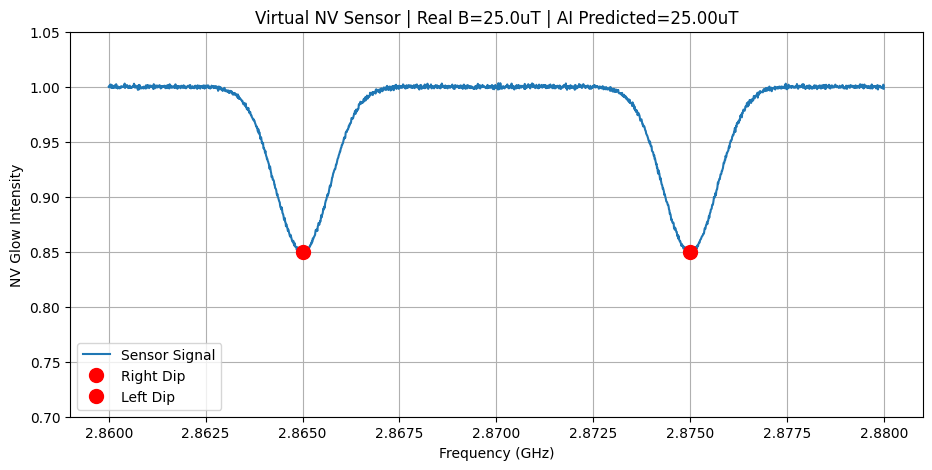

# NV-Diamond-AI-sensor

**AI Powered Simulation of NV Diamond Quantum Magnetic Sensor with 100% accuracy**

## Project Overview
This project simulates a Nitrogen-Vacancy (NV) center in diamond for quantum magnetic field sensing. 
The simulation demonstrates how an NV center responds to external magnetic fields and generates an ODMR (Optically Detected Magnetic Resonance) spectrum.
It is designed as a proof-of-concept for quantum sensing applications in physics and material science.

## Key Features
Quantum Physics Simulation: Models NV center spin states and Zeeman splitting
ODMR Spectrum Generation: Plots fluorescence vs microwave frequency
AI/ML Ready Data: Generates clean data for machine learning model training
Visualization: Automatic plotting of sensor response

## How to Run
1. Clone the repository
2. Install dependencies: pip install numpy 
3. Run the simulation: NV_Sensor_ai.py
4. The result graph will be saved as result.png

## Results
The graph below shows the simulated ODMR spectrum of an NV center under a magnetic field.
The dip in fluorescence indicates the resonance frequency shift due to the magnetic field.

## Tech Stack
Python NumPy Matplotlib Quantum Physics Data Visualization

## Author
Muhammad Musa
